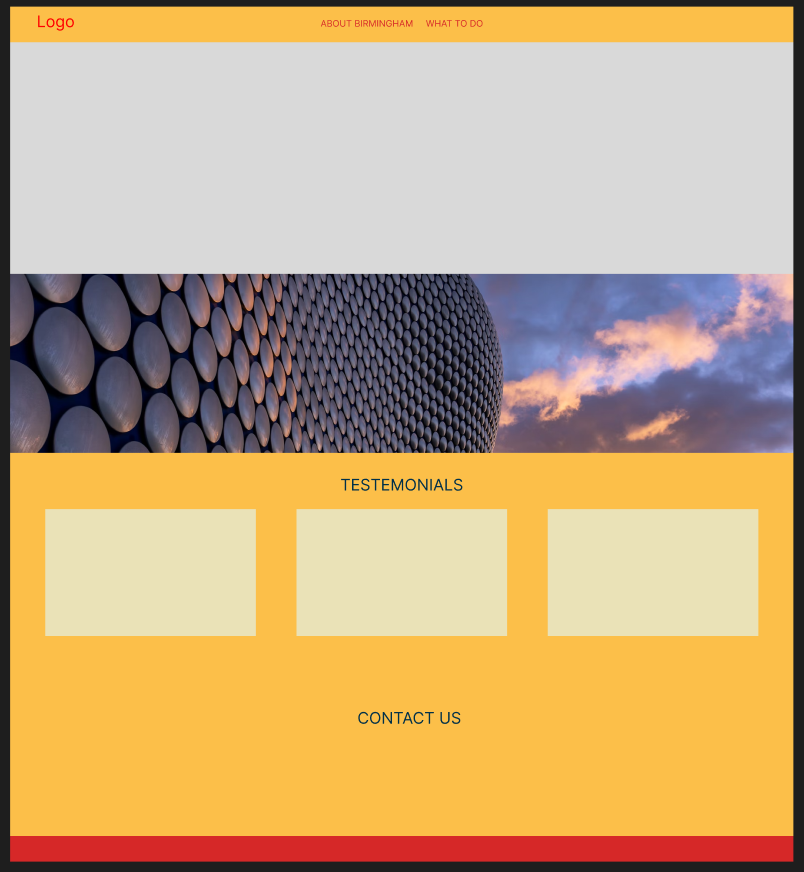
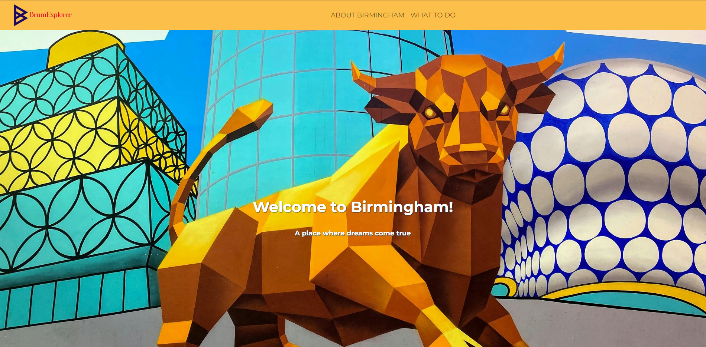
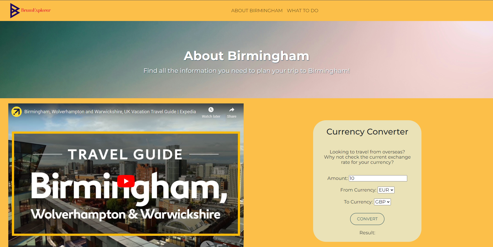

# Project BrumExplorer 

## Description
Brum Explorer is a website designed to assist tourists visiting Birmingham, United Kingdom. This project was developed by team Jabba(script)The Hutt and provides essential information and tools that inhance a tourists experience in the city.

### Brum Explorer has three main sections:

 1.About Birmingham: shows the user a short and video to expand their 
 ###
 2.Dining: discover many dining options from different cuisines.
 ###
 3.Currency Converter: easily convert from EUR, USD, JPY to GBP.

Brum Explorer was creater to address the needs of visitors. It aims to simplify and enhance a tourists overall experience in Birmignham. This website was developed through collaborative effort that offers a user friendly platform as well as practical tools. 

## Wireframe

Using Figma, we were able to wireframe out our design ideas. Providing our design team with a template to build the foundations for our site.

## Features

* Created using Boostrap 5, making our site modern and responsive.
* Mobile friendly, our site is designed to work across a variety of devices and screensizes. Adjusting automatically to provide our users with the most accessible solution.
* Utilise modals to provide interactive prompts to users.
  
## Screenshots

### Home Page

### What to Do

### About Birmingham

## Installation

This single static website can be deployed either locally or to a webserver. With the included "index.html" file containing the main code for the website, and the accompanying "style.css" stylesheet and "script.js" script file. Alternatively, the website can be found on the GitHub Pages link below.

Designed primarily for a desktop experience, the site can be accessed on small screen sizes, with a minimum screensize of 600px horizontally. Please keep this in mind when accessing the site on your device.

## Technology

Below is a look at the technologies that were adopted to create
Brum Explorer:

### APIs
* [Restaurants](https://rapidapi.com/ptwebsolution/api/restaurants222) - Use to pull data about the top rated restaurants in Birmingham, including information such as rating, address and description.
* [Currency](https://rapidapi.com/solutionsbynotnull/api/currency-converter18) - Used to provide realtime exchange rate currency data.

### Languages
* Style and layout - HTML & CSS
* Frontend Functionality - JavaScript
* API Management - JavaScript

## Credits
### Collaborators:
Suniel Mudhar
###
Tayyba Afzal
###
Olu Ola
###
Zainab Touati

### References:
Bootstrap - https://getbootstrap.com/

APIs - https://rapidapi.com/hub

Images - https://unsplash.com/

https://developer.mozilla.org/en-US/docs/Web/JavaScript/Reference/Global_Objects/undefined

https://coding-boot-camp.github.io/full-stack/github/professional-readme-guide

https://www.w3schools.com/bootstrap/tryit.asp?filename=trybs_ref_js_dropdown&stacked=h

### GitHub Pages:

[GitHub Pages](https://sunielmudhar.github.io/BrumExplorer/)
###
[Deployment Link](https://github.com/sunielmudhar/BrumExplorer)

## License
BrumExplorer is licensed by MIT License.
